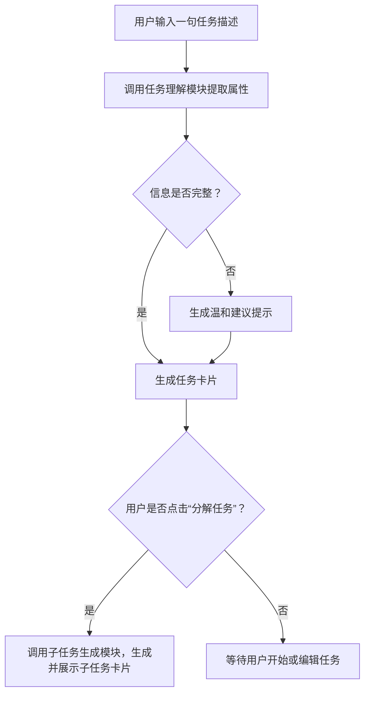

 **重新梳理优化后的实现方案**，包括：

- 📦 模块结构设计  
- 🧠 精简并增强的 Prompt  
- ⚙️ 开发功能清单（轻量易上手）  
- ✅ 流程图 & 交互节奏建议

---

## ✅ 模块结构（4大功能）

| 模块 | 功能 | 核心作用 | Prompt 支持 | 你需要开发 |
|------|------|----------|---------------|--------------|
| ① 任务理解模块 | 从用户输入中提取任务信息 | 提高输入自由度，简化表单填写 | ✅ 是 | ✅ 调用LLM并解析结构化JSON |
| ② 信息补全建议模块 | 缺少信息时提供轻提示 | 保留流畅体验 + 不打断流程 | ✅ 是 | ✅ 添加建议UI区域（非弹窗） |
| ③ 子任务生成模块 | 可选分解任务为小步骤 | 降低执行难度，缓解拖延 | ✅ 是 | ✅ 按钮触发 + 可编辑子任务卡片 |
| ④ 任务卡片展示模块 | 将任务结构化展示 | 提供直观操作和状态管理入口 | ⚠️ 非LLM | ✅ UI组件开发（React等） |

---

## 🧠 优化后的 Prompt 模板（最简 + 可控）

---

### 🟩 模块①：任务理解 Prompt

**用途**：用户可能只输入一句自然语言，提取出任务名、截止时间（DDL）、优先级。

```plaintext
请从用户的输入中提取任务信息，包括任务名、截止时间、优先级。

输出为JSON格式，若缺失信息，请标记为 "未设定"。

输入示例：
“明天之前写完报告，高优先级”

输出示例：
{
  "task_name": "写完报告",
  "deadline": "明天",
  "priority": "高"
}
```

---

### 🟨 模块②：信息补全建议 Prompt

**用途**：发现任务信息缺失时，生成一句温和提示，不打断主流程。

```plaintext
你是一个温柔的任务助手。如果用户创建任务时缺少重要信息（如截止时间或优先级），请生成一条可选建议，语气轻松、允许用户忽略。

示例输出（缺少DDL）：
“你还没设定截止时间哦～要不要我帮你估一个？比如今天晚上？”

只输出这类一句提示。
```

---

### 🟦 模块③：子任务生成 Prompt

**用途**：用户点击“分解任务”按钮后触发，生成 3～5 个可执行子任务，分配合理时间。

```plaintext
你是一个任务分解助手，用户希望将任务拆解为几步操作。请根据任务名称和总时长，生成 3~5 个子任务，并合理分配时间。

输入示例：
任务名称：写论文  
总时间：60分钟

输出格式（JSON）：
[
  {"subtask": "制定论文提纲", "duration": "10分钟"},
  {"subtask": "查阅文献", "duration": "20分钟"},
  {"subtask": "撰写初稿", "duration": "20分钟"},
  {"subtask": "校对修改", "duration": "10分钟"}
]
```

---

### 🟥 模块④：任务卡片展示（无需Prompt）

**作用**：整合前面提取的信息，展示任务卡片（可点击开始/编辑/分解）

#### 建议 UI 卡片字段：

```json
{
  "任务名": "写论文",
  "截止时间": "明天晚上",
  "优先级": "高",
  "子任务": [
    {"内容": "制定提纲", "进度": "未开始"},
    {"内容": "查资料", "进度": "未开始"}
  ]
}
```

#### 操作按钮建议：
- ✅ 开始任务  
- ✏️ 编辑任务  
- 🪄 分解子任务（调用子任务生成模块）

---

## ⚙️ 你需要实现的功能（前4模块）

| 功能点 | 技术建议 |
|--------|----------|
| LLM请求模块 | 将用户输入传给 LLM，接收结构化输出（如 JSON） |
| 缺失字段检测 | 如果字段为“未设定”，调用建议Prompt，渲染建议UI |
| 子任务展示与编辑 | 点击“分解任务”后调用LLM，展示卡片，可调整时间 |
| 任务卡片组件 | 包含任务标题、DDL、优先级、子任务、操作按钮 |

---

## 🔄 整体流程逻辑图（简化版）



---

## 🧪 最小可行组合（建议优先完成）

1. ✅ 用户一句输入 → 任务解析（Prompt 1）  
2. ✅ 不完整 → 温和建议展示（Prompt 2）  
3. ✅ 生成任务卡片 UI（任务名 + 操作按钮）  
4. ✅ “分解任务”按钮 → 子任务生成（Prompt 3）  
5. ✅ 前端记录任务状态（简单 JSON）
